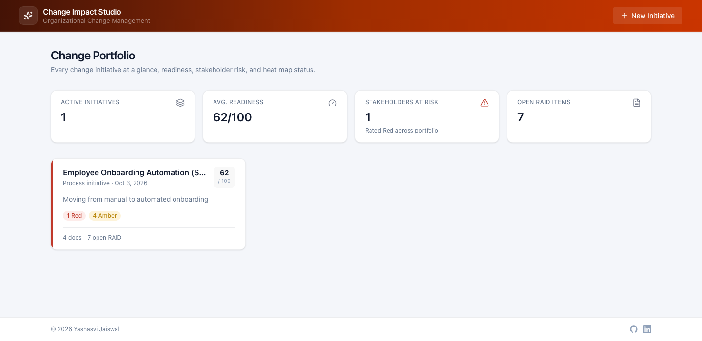
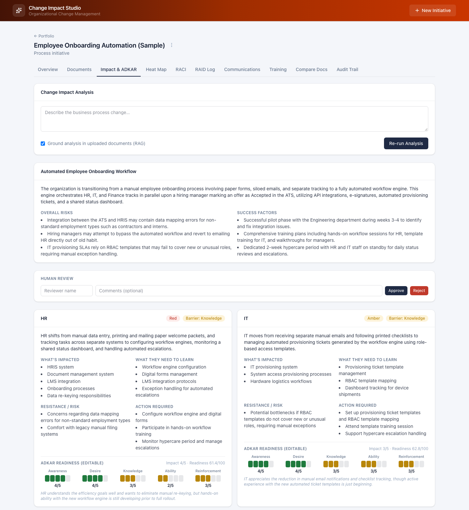
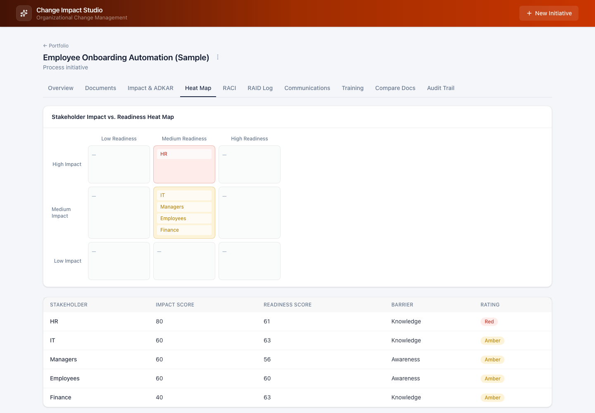
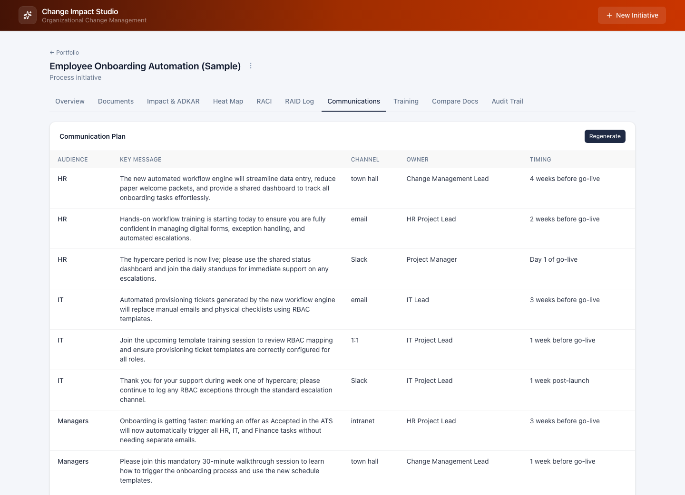
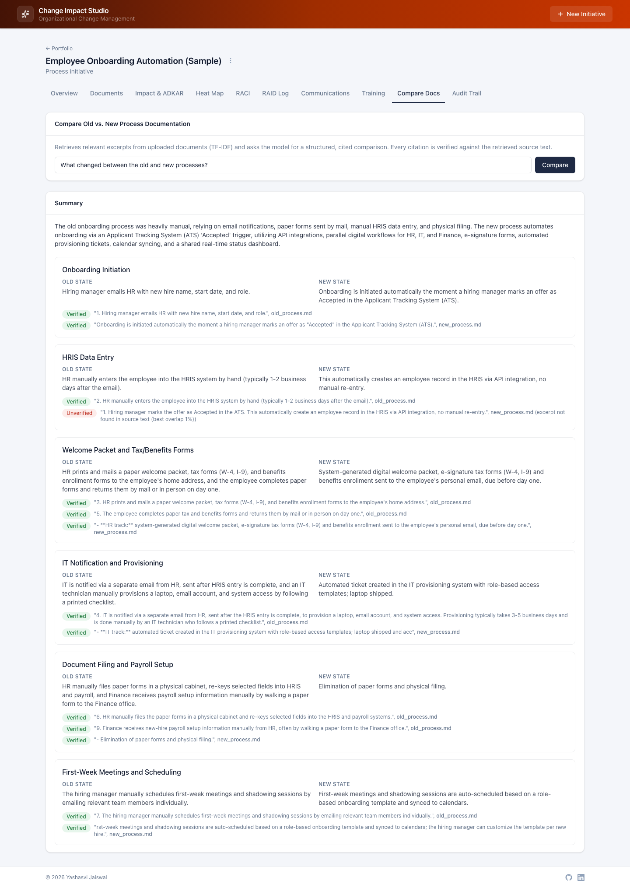

# AI Change Impact Studio

A full-stack Python application for organizational change management, built to model how impact assessments, stakeholder analysis, and change communications are actually produced in consulting practice, rather than as a generic LLM demo.

Given a description of a business process change, the system generates a stakeholder impact assessment scored against the Prosci ADKAR model, a Red/Amber/Green readiness heat map, a RACI matrix, a RAID log, a structured communication plan, a training needs matrix, and exportable Word and PowerPoint deliverables. It also supports retrieval-augmented generation over uploaded process documentation, so a user can ask what changed between an old and a new process and receive a cited, independently verified answer.

## Live demo

- Application: https://p1.yashjswl.com
- API: https://ai-change-impact-studio-api.onrender.com/health

The backend is hosted on Render's free tier, which spins down after inactivity, so the first request after a period of idleness can take up to a minute while it restarts.

## Screenshots

**Portfolio.** Every initiative with its readiness score, stakeholder risk counts, and open RAID items.



**Impact assessment with ADKAR scoring.** LLM-drafted stakeholder analysis grounded in the uploaded documents. ADKAR scores are editable, and the barrier point, readiness score, and heat rating recompute on every change.



**Readiness heat map.** Stakeholders plotted by impact against readiness and rated Red, Amber, or Green.



**Communication plan.** A structured plan by audience, message, channel, owner, and timing, generated from the impact analysis.



**Document comparison with citation verification.** A retrieval-grounded comparison of old and new process documents. Each citation is checked against the retrieved source text, so a paraphrased excerpt is flagged as unverified rather than accepted.



## Core technical focus

The backend is written entirely in Python, and the architecture is organized around two problems central to production LLM systems: structured output and retrieval-augmented generation.

**Structured LLM output.** Every generation task, impact analysis, RACI, RAID, communications, training matrices, document comparison, is implemented as a structured output call to Google Gemini, using Pydantic schemas as the response contract (`backend/app/ai/llm_schemas.py`). The LLM client includes retry logic and request timeouts for production reliability.

**Retrieval-augmented generation.** Uploaded documents are chunked and indexed with TF-IDF (`backend/app/ai/rag.py`), which avoids the overhead of an embedding model for a small, per-project document set. Retrieved chunks are passed to the LLM as grounding context, and every citation the model returns is independently checked against the retrieved source text (`backend/app/ai/citation_verify.py`) before the UI labels it as verified.

## Readiness scoring model

Each stakeholder is scored across the five Prosci ADKAR dimensions: Awareness, Desire, Knowledge, Ability, and Reinforcement. Prosci's methodology treats readiness as gated by the weakest dimension rather than as an average, since a stakeholder cannot demonstrate Ability without first having Desire. `backend/app/services/impact_service.py` identifies the first ADKAR dimension scoring 3 or below as the barrier point and weights the readiness score 65/35 toward that barrier over the raw average. Readiness and an LLM-assigned impact severity are then banded into a 3x3 grid and mapped to a Red, Amber, or Green rating through an explicit lookup table, which is unit tested against all nine grid cells.

## Stack

Backend: FastAPI, SQLAlchemy, SQLite (the `DATABASE_URL` environment variable can be pointed at Postgres for a persistent deployment). Google Gemini via the `google-genai` SDK for structured LLM output. TF-IDF (scikit-learn) for retrieval. `python-docx` and `python-pptx` for generating the Word and PowerPoint deliverables, including a native PowerPoint table with cell-level color formatting for the heat map slide, built without an image or charting dependency.

Frontend: React, Vite, TypeScript, Tailwind CSS.

## Running it locally

Backend:

```bash
cd backend
python3 -m venv .venv && source .venv/bin/activate
pip install -r requirements.txt
cp .env.example .env
# a free key is available at https://aistudio.google.com/apikey, no card required
uvicorn app.main:app --reload --port 8000
```

Frontend:

```bash
cd frontend
npm install
cp .env.example .env
npm run dev
```

## Project layout

```
backend/app/
  ai/            Gemini client, prompts, RAG retrieval, structured-output schemas, citation verification
  db/models.py   SQLAlchemy data model, 17 tables
  services/      business logic, one module per domain: impact, raci, raid, comms, training, exports
  routers/       HTTP layer over services/
  exporters/     docx and pptx document builders
frontend/src/
  pages/         one page per domain area
  components/    heatmap/, adkar/, approvals/, ui/
  api/           typed REST client
```

## Scope and limitations

Authentication is out of scope; this was built as a single-user tool. Schema management relies on SQLAlchemy's `create_all()` rather than a migration framework, which is adequate at this scale but not intended to scale further as-is. The application is deployed on a free-tier host without persistent disk storage, so the SQLite database resets on redeploy; this is the reason for the automatic seed step rather than a manual data-loading process. A production deployment would use Postgres and add authenticated reviewer accounts.

## Contact

From Yashasvi Jaiswal.

LinkedIn: [linkedin.com/in/yashjswl](https://www.linkedin.com/in/yashjswl/)

---

&copy; 2026 [Yashasvi Jaiswal](https://yashjswl.com). All rights reserved.

Email: [hello@yashjswl.com](mailto:hello@yashjswl.com)
